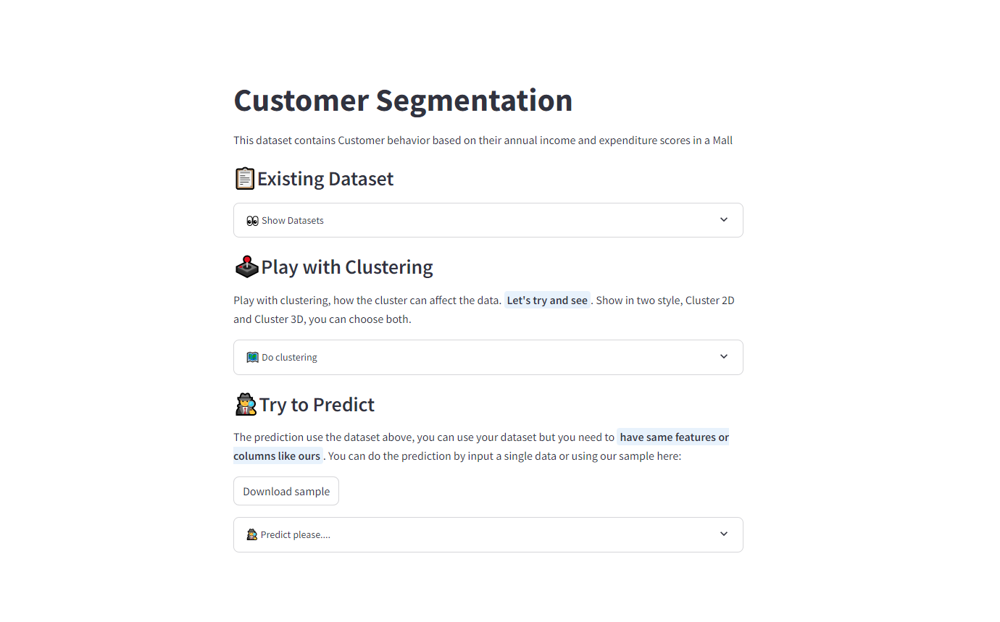

<h1 align="center">🏪Mall Customer Segmentation</h1>
<h3 align="center"><b>"What cluster are you in?"</b></h3>
<h4 align="center"><i>huh?</i></h4>

## 🚀 Customer Segmented
This simple 🏪Customer Segmentation Web-App provide how clustering work using `KMeans` Clustering. Users can choose the style of cluster (**2D or 3D**), also users can predict their own cluster by single input or using csv file.

<p align="center">
  <a href="https://customersegmented.streamlit.app/"></a>
</p>

<p> <b>Customer segmentation</b> is the process by which we divide our customers up based on common characteristics - such as demographics (if needed) or behaviours, so we can market to those customers more effectively.</p>

### 🔎 List of Columns
| List                   | Detail                                                                    |
| ---------------------- |---------------------------------------------------------------------------|
| CustomerID             | Unique ID assigned to the customer                                        |
| Gender                 | Gender of the customer (male or female)                                   |
| Age | are neat         | Age of the customer                                                       |
| Annual Income (k$)     | Annual Income of the customer                                             |
| Spending Score (1-100) | Score assigned by the mall based on customer behavior and spending nature |

## ⚙️Installation
1. **Clone the repository** `$ https://github.com/ditherr/customer-segmentation.git`
2. Go to the local folder (`../customer-segmentation`) based on clone above.
2. **Create a New Environment**
    ```
    conda create -p venv python==3.10.12 -y
    ```

3. **Activate The Environment**
    ```
    conda activate venv/
    ```

4. **Install The Requirements**
    ```
    pip install -r requirements.txt
    ```

## 👑Streamlit Application
You can Run it with two methods:
1. Run on the (Web) Cloud:
    🔗: [🏪Customer Segmented](https://customersegmented.streamlit.app/)
2. Run on the Local:
    ```
    streamlit run app.py
    ```


## ⚙️Library Versioning
**🐍Built with Python Version 3.10.12**

**📦List of Library versions used (*last time installed*)**:
```
  ipykernel==6.29.5
  pandas==2.1.4
  numpy==1.26.4
  matplotlib==3.9.2
  plotly==5.24.0
  scikit-learn==1.5.1
  xgboost==2.1.1
  streamlit==1.38.0
```
**note**: *you can change the version, or add another libraries that needed.*
