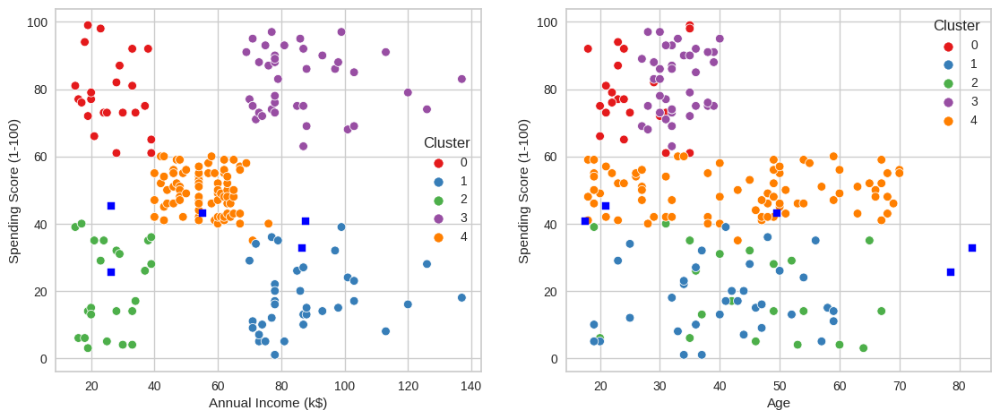
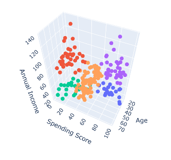

<h1 align="center">
  🏪Mall Customer Segmentation
</h1>

 <b>Customer segmentation</b> is the process by which we divide our customers up based on 
  common characteristics - such as demographics (if needed) or behaviours, 
  so we can market to those customers more effectively.

### 💡 Ideation
Idea and Dataset [Mall Customer Segmentation](https://www.google.com) on Kaggle.

### 🔎 List of Columns
| List                   | Detail                                                                    |
| ---------------------- |---------------------------------------------------------------------------|
| CustomerID             | Unique ID assigned to the customer                                        |
| Gender                 | Gender of the customer (male or female)                                   |
| Age | are neat         | Age of the customer                                                       |
| Annual Income (k$)     | Annual Income of the customer                                             |
| Spending Score (1-100) | Score assigned by the mall based on customer behavior and spending nature |

### 🚀 Existing Result
### KMean Clustering
  

### 3D Cluster
3D Clustering using [_**plotly**_](https://plotly.com/python/v3/3d-point-clustering/). (run all the line of code, and you will find this amazing plot😉.)
   
